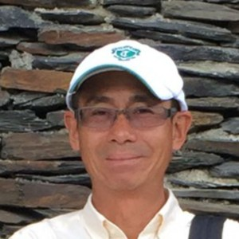

Wedding Party

<table style="width: 100%;">
<tbody>
<td></td>
<td></td>
</tbody>
</table>

Father of the BrideKing Yau ChanKing Yau took up farming after retiring from his career in the textile industry. When King Yau first learned Ju Yi and Andrew were engaged, he planned to raise a goat, harvest the fiber, and make a cashmere sweater to endure the cold Buffalo weather. Thankfully, the wedding is in the summer. Now he is excited that this will be his first time visiting the United States.
Father of the Bride
King Yau Chan
King Yau took up farming after retiring from his career in the textile industry. When King Yau first learned Ju Yi and Andrew were engaged, he planned to raise a goat, harvest the fiber, and make a cashmere sweater to endure the cold Buffalo weather. Thankfully, the wedding is in the summer. Now he is excited that this will be his first time visiting the United States.
Father of the GroomTom BanchichTom, a Classics professor,  enjoys Plato, football, playing with toy dinosaurs, and Kenny Rogers' "Jackass." A man of many surprising talents, he has discovered a passion for wedding planning and has helped Ju Yi and Andrew answer many important questions along the way. He also harbors a passion for doing dishes; his future daughter-in-law has to fight him to stop whenever he visits their apartment.
Father of the Groom
Tom Banchich
Tom, a Classics professor, enjoys Plato, football, playing with toy dinosaurs, and Kenny Rogers’ “Jackass.” A man of many surprising talents, he has discovered a passion for wedding planning and has helped Ju Yi and Andrew answer many important questions along the way. He also harbors a passion for doing dishes; his future daughter-in-law has to fight him to stop whenever he visits their apartment.

Mother of the BrideLi Chin HuangLi Chin sees Ju Yi as her most well-deserved bragging right. Her only daughter is getting married halfway around the world, so she is (of course) feeling kind of lost. However, knowing Andrew will take great care of Ju Yi, Li Chin is happy to hand her best daughter over to him.
Mother of the Bride
Li Chin Huang
Li Chin sees Ju Yi as her most well-deserved bragging right. Her only daughter is getting married halfway around the world, so she is (of course) feeling kind of lost. However, knowing Andrew will take great care of Ju Yi, Li Chin is happy to hand her best daughter over to him.
Mother of the GroomSue BanchichSue is a writer/editor for Roswell Park Cancer Institute. In her spare time she enjoys researching genealogy and watching videos of surgical procedures while her family is trying to eat dinner. Sue always enjoys helping Andrew plan surprises for Ju Yi, and has helped a great deal with the wedding plans as well.
Mother of the Groom
Sue Banchich
Sue is a writer/editor for Roswell Park Cancer Institute. In her spare time she enjoys researching genealogy and watching videos of surgical procedures while her family is trying to eat dinner. Sue always enjoys helping Andrew plan surprises for Ju Yi, and has helped a great deal with the wedding plans as well.

Maid of HonorLiz PenepentLiz and Ju Yi started interning at Roswell Park Cancer Institute together. They became good friends instantly. Liz was also the matchmaker for Ju Yi and Andrew. Ju Yi believes that with Liz’s great taste, amazing organization skills, and kindness, Liz will be the best Maid of Honor ever.
Maid of Honor
Liz Penepent
Liz and Ju Yi started interning at Roswell Park Cancer Institute together. They became good friends instantly. Liz was also the matchmaker for Ju Yi and Andrew. Ju Yi believes that with Liz’s great taste, amazing organization skills, and kindness, Liz will be the best Maid of Honor ever.
Best ManDavid BanchichDave is Andrew’s younger brother. He is fascinated by primates, reptiles, and nature. Ju Yi and Andrew are always interested by what Dave tells them about the natural world.
Best Man
David Banchich
Dave is Andrew’s younger brother. He is fascinated by primates, reptiles, and nature. Ju Yi and Andrew are always interested by what Dave tells them about the natural world.

BridesmaidHui Wen ChenHui Wen (Sonya) and Ju Yi both taught English at HESS International Educational Group when they were in college, and the two became good friends. If you hear Hui Wen call Ju Yi “Emma,” do not be confused; “Teacher Emma” was Ju Yi’s “stage name” as a teacher. Hui Wen is sweet, enthusiastic, and speaks both English and Mandarin Chinese very well. Ju Yi knows Hui Wen would be a wonderful ambassador at the wedding.

Bridesmaid
Hui Wen Chen
Hui Wen (Sonya) and Ju Yi both taught English at HESS International Educational Group when they were in college, and the two became good friends. If you hear Hui Wen call Ju Yi “Emma,” do not be confused; “Teacher Emma” was Ju Yi’s “stage name” as a teacher. Hui Wen is sweet, enthusiastic, and speaks both English and Mandarin Chinese very well. Ju Yi knows Hui Wen would be a wonderful ambassador at the wedding.
GroomsmanRobert HaywardRobert is Andrew's cousin. He is a world traveler and went to Iceland with Andrew and his sister, Emily. Robert is an engineer at a nuclear power plant. If he is glowing it is (probably) because he just married Abbey Tobe last April.
Groomsman
Robert Hayward
Robert is Andrew’s cousin. He is a world traveler and went to Iceland with Andrew and his sister, Emily. Robert is an engineer at a nuclear power plant. If he is glowing it is (probably) because he just married Abbey Tobe last April.

GroomsmanJan HoffmeyerJan is a medical student from Germany. He met Andrew at Kevin Guest House, where he lived while researching cancer vaccines at Roswell Park Cancer Institute. He dominates at computer games. Ask him about his stein.
Groomsman
Jan Hoffmeyer
Jan is a medical student from Germany. He met Andrew at Kevin Guest House, where he lived while researching cancer vaccines at Roswell Park Cancer Institute. He dominates at computer games. Ask him about his stein.
